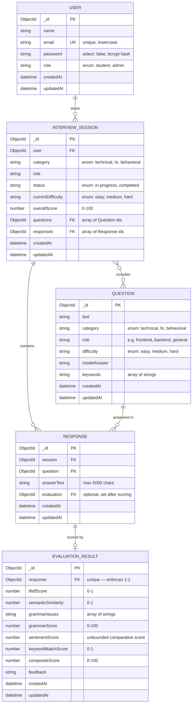

# INTA — Entity Relationship Diagram

Reflects the Mongoose schemas in `server/models/` as of the latest schema review.

## Relationships

| Relationship | Cardinality | Enforced by |
|---|---|---|
| User → InterviewSession | 1 : many | `InterviewSession.user` (required ref) |
| InterviewSession ↔ Question | many : many | `InterviewSession.questions[]` (ref array) |
| InterviewSession → Response | 1 : many | `InterviewSession.responses[]` and `Response.session` (bidirectional refs) |
| Question → Response | 1 : many | `Response.question` (required ref) |
| Response → EvaluationResult | 1 : 0-or-1 | `Response.evaluation` (optional ref) + `EvaluationResult.response` (**unique**, required ref) |

The Response ↔ EvaluationResult link is intentionally 1:1, not 1:many — `EvaluationResult.response` has `unique: true`, so the database itself rejects a second evaluation for the same response. It's created as a separate document (rather than embedded) because `sessionController.submitAnswer` creates the `Response` first, then the `EvaluationResult` referencing it, then patches `Response.evaluation` — reversed order would violate `EvaluationResult`'s `required: true` on `response`.

## Indexes

| Model | Index | Reason |
|---|---|---|
| User | `email` (unique) | Login lookups; enforces one account per email |
| Question | `{ category, role, difficulty }` (compound) | Matches the exact query shape used to pick the first/next question |
| InterviewSession | `{ user, status }` (compound) | Supports "list this user's sessions" / "this user's in-progress sessions" |
| Response | `session`, `question` | Foreign-key lookups (all responses for a session; analytics per question) |
| EvaluationResult | `response` (unique) | 1:1 integrity + evaluation lookup by response |

## Enums

| Field | Allowed values |
|---|---|
| `User.role` | `student`, `admin` |
| `Question.category`, `InterviewSession.category` | `technical`, `hr`, `behavioral` |
| `Question.difficulty`, `InterviewSession.currentDifficulty` | `easy`, `medium`, `hard` |
| `InterviewSession.status` | `in-progress`, `completed` |

`role` (job track, e.g. "frontend"/"backend") is deliberately **not** an enum on `Question`/`InterviewSession` — it's an open-ended, extensible field (only `trim`/`lowercase`/`maxlength` constrained), since the app doesn't define a closed list of tracks.

## Virtuals

| Model | Virtual | Computes |
|---|---|---|
| User | `initials` | First letters of up to 2 name parts, e.g. "Ankita Gurung" → `"AG"` |
| Question | `keywordCount` | `keywords.length` |
| InterviewSession | `questionCount`, `responseCount`, `isCompleted` | Array lengths and `status === "completed"` |
| Response | `wordCount` | Word count of `answerText` |

All virtuals are enabled in `toJSON`/`toObject` output, so they appear automatically in API responses without any controller changes.
